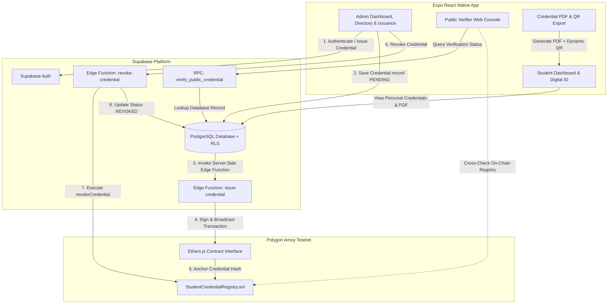

# D-SIVC

**Blockchain-Based Decentralized Student Identity and Authentication System with Verifiable Credentials**

D-SIVC is a secure, modern mobile application and hybrid blockchain architecture designed to digitize and safeguard academic credentials. By combining off-chain student profile management in Supabase PostgreSQL with cryptographic SHA-256 hash anchoring on the Polygon Amoy Testnet, D-SIVC provides tamper-evident, instant public verification of academic records without exposing sensitive Personally Identifiable Information (PII) on the public blockchain.


-8247E5?style=for-the-badge&logo=polygon&logoColor=white)


---

## Overview

Traditional academic credential issuance and verification rely on paper certificates, manual registry lookups, or centralized institutional portals. These methods are susceptible to document forgery, fraudulent modifications, slow background checks, and single points of failure.

D-SIVC addresses these challenges by introducing a privacy-preserving hybrid architecture:
- **Off-Chain Identity Storage**: Student personal information (full name, roll number, department, course, institution) remains securely stored in a Supabase PostgreSQL database governed by fine-grained Row Level Security (RLS) policies.
- **On-Chain Cryptographic Anchoring**: A unique SHA-256 digest computed from the credential data is anchored directly to the Polygon Amoy blockchain.
- **On-Chain Verifiable Registry**: The smart contract records only the credential identifier, SHA-256 hash, issuer address, issuance timestamp, and revocation state.
- **Privacy Preservation**: No personal student information (PII) is ever published to the public blockchain ledger.

---

## Problem Statement

Educational institutions face persistent challenges regarding degree fraud, unverified credentials, and inefficient verification processes. Employers and background check agencies spend weeks manually verifying diplomas through university registrars. Existing electronic verification portals remain centralized, vulnerable to data tampering, single-point server outages, or institutional database corruption. D-SIVC solves this problem by combining cryptographic data hashing with a decentralized Ethereum L2 smart contract registry on Polygon Amoy, ensuring instant, globally accessible, and tamper-evident verification.

---

## Key Features

- **Student Authentication & Profile Management**: Secure sign-in and registration linked to student academic profiles.
- **Admin & Institution Portal**: Administrative suite for authorized institutional personnel to manage student directories and issue credentials.
- **Digital Student Identity Card**: Interactive in-app digital ID card displaying student information, academic credentials, and quick QR launcher.
- **SHA-256 Cryptographic Hashing**: Client and server-side generation of deterministic SHA-256 digests (`expo-crypto`) representing immutable credential state.
- **Polygon Amoy Blockchain Anchoring**: Automated smart contract anchoring via server-side Supabase Edge Functions on Polygon Amoy Testnet (Chain ID `80002`).
- **Public Verifier Console**: Open web authenticator interface (`/verify`) allowing anyone to instantly validate credentials using a Credential ID or SHA-256 Hash.
- **Dynamic QR Code Verification**: In-app QR code modal encoding public verification URLs (`https://d-sivc-verifier.vercel.app/verify?credential=<ID>`) for fast mobile scanning.
- **Share Verification Link**: One-tap sharing of public verification links via native device share sheets.
- **Direct Blockchain Explorer Deep Links**: "View on PolygonScan" integration providing direct access to on-chain transaction hashes on the Polygon Amoy Explorer.
- **Credential PDF Export**: Automated generation and downloading of official credential PDFs embedded with student metadata, cryptographic SHA-256 digest, blockchain transaction hash, and dynamic QR verification code.
- **Admin Search & Filter**: Real-time multi-field search (by student name, roll number, credential ID, email) combined with dual status (`ALL`, `ANCHORED`, `PENDING`, `FAILED`, `REVOKED`) and type (`Degree`, `Certificate`, `Internship`, `Achievement`, `Other`) filter pills.
- **On-Chain Credential Revocation**: Administrative capability to execute smart contract transactions revoking invalid or compromised credentials on-chain.
- **Role-Based Access Control (RBAC)**: Strict authorization separation between `student` and `admin` operational roles enforced via Supabase JWT claims and database profiles.

---

## System Architecture



---

## User Roles

### Student
- Access personal digital identity card and academic credentials.
- Generate dynamic QR codes pointing to public verification URL.
- Download officially formatted Credential PDFs with embedded QR codes.
- Share verification links directly via native device share tools.
- Inspect on-chain transaction status on PolygonScan.

### Admin / Institution
- Overview institutional statistics (Total Students, Credentials Issued, Anchored, Revoked).
- Manage student directory with real-time search.
- Issue verifiable credentials to registered students with auto SHA-256 calculation.
- Filter credentials by status (`ANCHORED`, `PENDING`, `FAILED`, `REVOKED`) and credential type (`Degree`, `Certificate`, `Internship`, `Achievement`, `Other`).
- Perform on-chain credential revocations via server-side signed transactions.

### Public Verifier
- Access public verifier web console (`/verify`).
- Input Credential ID or SHA-256 Hash.
- Verify status (`VERIFIED`, `REVOKED`, `INVALID`, `PENDING`).
- Inspect complete cryptographic digest and Polygon Amoy transaction details.
- Launch PolygonScan explorer for independent blockchain validation.

---

## Credential Lifecycle

1. **Issuance Request**: Admin selects student, enters credential type and metadata, and submits issuance form.
2. **SHA-256 Computation**: System generates unique credential payload and computes deterministic SHA-256 hash.
3. **Database Staging**: Credential is saved in Supabase with `blockchain_status = 'PENDING'`.
4. **On-Chain Anchoring**: Supabase Edge Function (`issue-credential`) signs transaction using institutional private key and invokes `issueCredential()` on `StudentCredentialRegistry.sol`.
5. **Confirmation & Update**: Transaction is confirmed on Polygon Amoy (`Chain ID 80002`). `blockchain_tx_hash` and `blockchain_status = 'ANCHORED'` are saved in PostgreSQL.
6. **Public Verification & QR**: Credential QR and public verification link (`https://d-sivc-verifier.vercel.app/verify?credential=<ID>`) become active.
7. **Revocation (Optional)**: Admin triggers revocation. Edge Function executes `revokeCredential()` on smart contract, updating database status to `REVOKED`.

---

## Blockchain Integration

D-SIVC utilizes the **Polygon Amoy Testnet** for decentralized cryptographic anchoring.

- **Network Name**: Polygon Amoy Testnet
- **Chain ID**: `80002`
- **Smart Contract Address**: [`0x9ee5cd0d9D08d07d5547b2402240aD11F9761cA0`](https://amoy.polygonscan.com/address/0x9ee5cd0d9D08d07d5547b2402240aD11F9761cA0)
- **Explorer**: [PolygonScan Amoy Explorer](https://amoy.polygonscan.com/)
- **Security Guarantee**: Mobile clients never store or handle private keys. All blockchain write transactions are constructed, signed, and broadcast server-side via Supabase Edge Functions.

---

## Smart Contract

The `StudentCredentialRegistry.sol` contract manages the on-chain registry of academic credentials. It inherits OpenZeppelin's `Ownable` pattern to restrict issuance and revocation rights to the institution's wallet.

```solidity
// Key Contract Interface
function issueCredential(string calldata credentialId, bytes32 credentialHash) external onlyOwner;
function revokeCredential(string calldata credentialId) external onlyOwner;
function verifyCredential(string calldata credentialId, bytes32 expectedHash) external view returns (bool isValid, bool isRevoked);
function getCredential(string calldata credentialId) external view returns (string memory id, bytes32 hash, address issuer, uint256 timestamp, bool revoked, bool exists);
```

### On-Chain Data Structure
```solidity
struct CredentialRecord {
    string credentialId;
    bytes32 credentialHash;
    address issuer;
    uint256 timestamp;
    bool revoked;
    bool exists;
}
```

> **Zero-PII Note**: Student names, roll numbers, grades, and email addresses are NEVER stored in the smart contract storage.

---

## Database Architecture

### `profiles` Table
Stores user account profiles and role assignments.

| Field | Type | Description |
| :--- | :--- | :--- |
| `id` | UUID (PK) | References `auth.users.id` |
| `full_name` | TEXT | User's complete legal name |
| `email` | TEXT | Account email address |
| `role` | TEXT | User role (`student` or `admin`) |
| `roll_number` | TEXT | Institutional student roll number |
| `course` | TEXT | Academic degree / course name |
| `department` | TEXT | Academic department |
| `institution` | TEXT | Educational institution name |
| `created_at` | TIMESTAMPTZ | Profile creation timestamp |

### `credentials` Table
Stores structured credential data and blockchain status tracking.

| Field | Type | Description |
| :--- | :--- | :--- |
| `id` | UUID (PK) | Primary key record identifier |
| `credential_id` | TEXT (Unique) | Public unique ID (e.g., `DSIVC-1790381933069-760`) |
| `student_id` | UUID (FK) | References `profiles.id` |
| `credential_type` | TEXT | Type of credential (e.g., `Degree`, `Certificate`) |
| `credential_data` | JSONB | Off-chain credential payload (grades, degree details) |
| `credential_hash` | TEXT | SHA-256 cryptographic hash of credential data |
| `blockchain_tx_hash` | TEXT | Polygon Amoy transaction hash |
| `blockchain_status` | TEXT | Status (`PENDING`, `ANCHORED`, `REVOKED`, `FAILED`) |
| `issued_at` | TIMESTAMPTZ | Timestamp of issuance |
| `revoked_at` | TIMESTAMPTZ | Timestamp of revocation (nullable) |

---

## Authentication & Authorization

- **Authentication**: Powered by Supabase Auth (Email & Password).
- **Session Persistence**: Automated JWT session refresh handled by `AuthContext`.
- **Authorization & RLS**: Fine-grained Row Level Security (RLS) policies in PostgreSQL ensure students can only view their own credentials, while admins have global read and issuance permissions.

---

## QR Code Verification

- **QR Payload**: Encodes the public verification URL (`https://d-sivc-verifier.vercel.app/verify?credential=<CREDENTIAL_ID>`).
- **Privacy Assurance**: The QR code contains no personal student data.
- **Cross-Platform QR Rendering**: Mobile-compatible canvas-free QR rendering for Expo Go, Android, iOS, and Expo Web.

---

## Credential PDF

- **Automated Document Generation**: Produces formatted credential documents incorporating institutional header branding, student details, course information, SHA-256 digest, Polygon transaction hash, and dynamic QR verification code.
- **Platform Behavior**: Uses `expo-print` and `expo-sharing` on iOS/Android for native PDF creation and sharing, and browser print/save controls on Web.

---

## Admin Search & Filtering

- **Real-Time Search**: Instant multi-field filtering across student names, roll numbers, credential IDs, and email addresses.
- **Status Filter Pills**: Quick tab filters (`ALL`, `ANCHORED`, `PENDING`, `FAILED`, `REVOKED`).
- **Type Filter Pills**: Category filters (`ALL`, `Degree`, `Certificate`, `Internship`, `Achievement`, `Other`).

---

## Blockchain Explorer Integration

- **"View on PolygonScan" Button**: Direct deep link embedded in credential detail views and public verifier results pointing to `https://amoy.polygonscan.com/tx/<TX_HASH>`.
- **Transparent Auditability**: Enables third-party verifiers to independently verify block numbers, gas usage, and smart contract event logs.

---

## UI / UX Design

- **Theme**: Premium dark aesthetic (`#0D0F10` background, `#181B1C` cards, `#303535` borders).
- **Icon-Only Floating Bottom Navigation (`FloatingNavBar`)**: Modern 4-tab floating navigation bar featuring equal-width icon buttons (`flex: 1`) with subtle green-tinted active pill backgrounds (`rgba(16, 185, 129, 0.15)`):
  - **Dashboard**: Home Icon (`Home`)
  - **Students**: Users Icon (`Users`)
  - **Credentials**: Award Icon (`Award`)
  - **Profile**: User Icon (`User`)

---

## Technology Stack

| Domain | Technology / Library | Version | Description |
| :--- | :--- | :--- | :--- |
| **Frontend** | React Native | 0.86.3 | Cross-platform mobile framework |
| | Expo SDK | 57.0.25 | Mobile application platform |
| | TypeScript | 6.0.3 | Static type safety |
| | Expo Router | 57.0.23 | File-based app routing |
| | expo-crypto | 57.0.3 | Cryptographic SHA-256 hashing |
| | expo-print / expo-sharing | 57.0.0 | PDF document generation & sharing |
| | lucide-react-native | 0.475.0 | Modern UI icon suite |
| **Backend** | Supabase Auth | - | User identity & JWT auth |
| | Supabase PostgreSQL | - | Relational database with RLS policies |
| | Supabase Edge Functions | Deno Runtime | Server-side TypeScript execution |
| **Blockchain** | Solidity | 0.8.20 | Smart contract language |
| | Polygon Amoy Testnet | Chain ID 80002 | Ethereum L2 scaling testnet |
| | Hardhat | 2.22.2 | Smart contract development suite |
| | Ethers.js | 6.17.0 | Ethereum wallet & RPC interface |
| | OpenZeppelin | 5.0.2 | Standardized contract security (`Ownable`) |

---

## Project Structure

```
D-SIVC/
├── app/                        # Expo Router application screens & navigation
│   ├── (admin)/                # Administrative workspace
│   │   ├── _layout.tsx
│   │   ├── credentials.tsx    # Credential management & revocation
│   │   ├── dashboard.tsx      # Admin stats & navigation hub
│   │   ├── issue.tsx          # Credential issuance form
│   │   └── students.tsx       # Student registry list
│   ├── (auth)/                 # Authentication screens
│   │   ├── _layout.tsx
│   │   ├── login.tsx          # User login
│   │   └── register.tsx       # User registration
│   ├── (student)/              # Student workspace
│   │   ├── _layout.tsx
│   │   ├── [id].tsx           # Student credential detail view
│   │   ├── credentials.tsx    # Student credentials list
│   │   └── dashboard.tsx      # Student profile & digital ID card
│   ├── verify/                 # Public verification screen
│   │   └── index.tsx          # Public credential authenticator
│   ├── _layout.tsx             # Root app navigator & AuthProvider
│   └── index.tsx               # App entry routing redirect
├── assets/                     # Application branding & image assets
├── blockchain/                 # Hardhat smart contract development workspace
│   ├── contracts/
│   │   └── StudentCredentialRegistry.sol
│   ├── deployment/
│   │   └── amoy-deployment.json
│   ├── scripts/
│   │   └── deploy.ts
│   ├── test/
│   │   └── StudentCredentialRegistry.test.ts
│   ├── hardhat.config.ts
│   └── package.json
├── components/                 # Shared React Native UI components
│   ├── CustomButton.tsx
│   ├── CustomInput.tsx
│   ├── FloatingNavBar.tsx     # Icon-only floating bottom navigation
│   ├── QRCodeView.tsx
│   └── StatusBadge.tsx
├── constants/                  # Color theme & application constants
│   └── theme.ts
├── context/                    # React Context providers
│   └── AuthContext.tsx
├── lib/                        # Supabase client initialization
│   └── supabase.ts
├── services/                   # Frontend API services
│   ├── authService.ts
│   ├── credentialService.ts
│   ├── pdfService.ts          # Credential PDF generation service
│   └── verificationService.ts
├── supabase/                   # Database migrations & Edge Functions
│   ├── functions/
│   │   ├── issue-credential/   # Server-side anchoring Edge Function
│   │   └── revoke-credential/  # Server-side revocation Edge Function
│   └── migrations/
│       └── 20260925_init_schema.sql
├── types/                      # TypeScript interface definitions
│   └── index.ts
├── app.json                    # Expo configuration file
├── package.json                # React Native project dependencies
├── tsconfig.json               # TypeScript compiler configuration
└── README.md                   # Project documentation
```

---

## Setup & Installation

### Prerequisites
- Node.js (v18 or higher)
- npm or bun
- Expo Go app on mobile device or Android/iOS emulator

### Setup Instructions

1. **Clone the Repository**:
   ```bash
   git clone https://github.com/Kuldeepbishnoi2005/D-SIVC.git
   cd D-SIVC
   ```

2. **Install Application Dependencies**:
   ```bash
   npm install
   ```

3. **Install Blockchain Workspace Dependencies**:
   ```bash
   cd blockchain
   npm install
   cd ..
   ```

4. **Configure Environment Variables**:
   Create `.env` in the root directory:
   ```env
   EXPO_PUBLIC_SUPABASE_URL=your_supabase_project_url
   EXPO_PUBLIC_SUPABASE_ANON_KEY=your_supabase_anon_key
   EXPO_PUBLIC_VERIFIER_URL=https://d-sivc-verifier.vercel.app/verify
   ```

   Create `blockchain/.env` for Hardhat:
   ```env
   BLOCKCHAIN_PRIVATE_KEY=your_deployer_private_key
   POLYGON_AMOY_RPC_URL=https://polygon-amoy.drpc.org
   ```

5. **Start Mobile App Dev Server**:
   ```bash
   npx expo start
   ```

---

## Environment Variables

| Variable | Scope | Description |
| :--- | :--- | :--- |
| `EXPO_PUBLIC_SUPABASE_URL` | Mobile App | Supabase project URL |
| `EXPO_PUBLIC_SUPABASE_ANON_KEY` | Mobile App | Public client anon key |
| `EXPO_PUBLIC_VERIFIER_URL` | Mobile App | Public web verifier base URL |
| `BLOCKCHAIN_PRIVATE_KEY` | Edge Function / Hardhat | Server-side institutional deployer key |
| `POLYGON_AMOY_RPC_URL` | Edge Function / Hardhat | RPC node endpoint for Polygon Amoy |
| `CONTRACT_ADDRESS` | Edge Function | Deployed `StudentCredentialRegistry` contract address |

---

## Smart Contract Deployment

```bash
cd blockchain

# Compile Solidity contracts
npm run compile

# Run Hardhat unit test suite
npm test

# Deploy to Polygon Amoy Testnet
npm run deploy:amoy
```

---

## Verification Flow

1. User or third-party opens public verifier web console (`/verify`).
2. Enters Credential ID (e.g., `DSIVC-1790381933069-760`) or scans QR code.
3. System fetches record via Supabase RPC and queries smart contract state on Polygon Amoy.
4. Result displays real-time status (`VERIFIED`, `REVOKED`, `INVALID`, `PENDING`), cryptographic SHA-256 digest, issuer wallet address, and PolygonScan link.

---

## Verified Test Results

| Test Suite / Metric | Command | Result |
| :--- | :--- | :--- |
| **TypeScript Compiler** | `npx tsc --noEmit` | **0 errors** |
| **ESLint Check** | `npx expo lint` | **0 errors, 0 warnings** |
| **Expo Doctor Health** | `npx expo-doctor` | **21/21 checks passed** |
| **Web Production Build** | `npx expo export --platform web` | **Successful (20 static routes)** |
| **Smart Contract Tests** | `cd blockchain && npm test` | **14/14 tests passed** |

---

## Verified On-Chain Transactions

| Lifecycle Event | Status | Polygon Amoy Explorer Link |
| :--- | :--- | :--- |
| **Contract Deployment** | Active | [`0x9ee5cd0d9D08d07d5547b2402240aD11F9761cA0`](https://amoy.polygonscan.com/address/0x9ee5cd0d9D08d07d5547b2402240aD11F9761cA0) |
| **Credential Issuance** | `ANCHORED` | [`0xd18fc704d4149fbc09a505a32e4baaf82389dd28a2e978c850ca60d233fccb59`](https://amoy.polygonscan.com/tx/0xd18fc704d4149fbc09a505a32e4baaf82389dd28a2e978c850ca60d233fccb59) |
| **Credential Revocation** | `REVOKED` | [`0x2812a591be1ed7fc42eef45d03963280304d65e3f0c73aa915137ba508365730`](https://amoy.polygonscan.com/tx/0x2812a591be1ed7fc42eef45d03963280304d65e3f0c73aa915137ba508365730) |

---

## Security

- **Zero-PII On-Chain**: Personal data remains stored off-chain in Supabase; only SHA-256 hashes are recorded on Polygon Amoy.
- **Server-Side Key Isolation**: Private keys are maintained exclusively as Supabase Edge Function secrets and never exposed to mobile clients.
- **Row Level Security (RLS)**: Enforces strict data isolation so students can only access their own records.
- **Role-Based Authorization**: Administrative tasks require authenticated admin role profiles.

---

## Known Limitations

- Deployed on Polygon Amoy Testnet (Chain ID `80002`).
- Requires testnet POL tokens for smart contract gas fees.
- Full off-chain metadata verification depends on Supabase database connectivity.

---

## Future Scope

- Integration with W3C Verifiable Credentials (VC) data standards.
- Production deployment on Polygon Mainnet / Ethereum L2 networks.
- Multi-university federated smart contract issuance networks.

---

## Academic Project

**D-SIVC** was developed as a B.Tech Capstone Project in Computer Science & Engineering.

- **Developer**: Kuldeep Bishnoi ([@Kuldeepbishnoi2005](https://github.com/Kuldeepbishnoi2005))

---

## License

Distributed under the **MIT License**. Refer to [LICENSE](LICENSE) for details.
